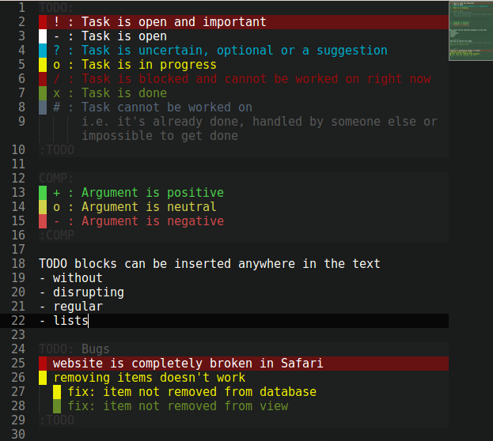

# TODO file syntax

[Sublime Text 3][st3] syntax definition and color scheme for plain text files containing lists of tasks that need to be done (i.e. ToDos). The Sublime Text color scheme is based on [FreshCut by Dayle Rees][freshcut].

### Syntax

#### TODO Block

Start a TODO block using `TODO:`, optionally followed by a title, as its first line. Finally, you can end the TODO block using `:TODO` as the last line.

Within the TODO block you can add tasks that start with one of the characters below followed by a whitespace:

- `!`: Task is open and important
- `-`: Task is open
- `?`: Task is uncertain, optional or a suggestion
- `o`: Task is in progress
- `/`: Task is blocked and cannot be worked on right now
- `x`: Task is done
- `#`: Task cannot be worked on (i.e. it's already done, handled by someone else or impossible to get done)

#### COMP Block

Start a comparison block using `TODO:` optionally followed by a title, as its first line. Finally, you can end the block using `:TODO` as the last line.

Within the comparison block you can add pros and cons with one of the characters below followed by a whitespace:

- `+`: Pro argument
- `-`: Contra argument
- `?`: Uncertain argument

## Installation

### Use prebuilt files

- Sublime Text
    - Copy all files in `sublime` directory into Sublime Text's `Packages/User` directory.

### Build it yourself

1. Install [syntax tools][syntax-tools]
2. Create and deploy files
    - Sublime Text: `<path-to-syntax-tools>/build todo src/sublime`

[freshcut]: https://github.com/daylerees/colour-schemes/blob/master/legacy/Contrast/FreshCut.tmTheme
[st3]: http://www.sublimetext.com/
[syntax-tools]: https://github.com/ThomasGreiner/syntax-tools
